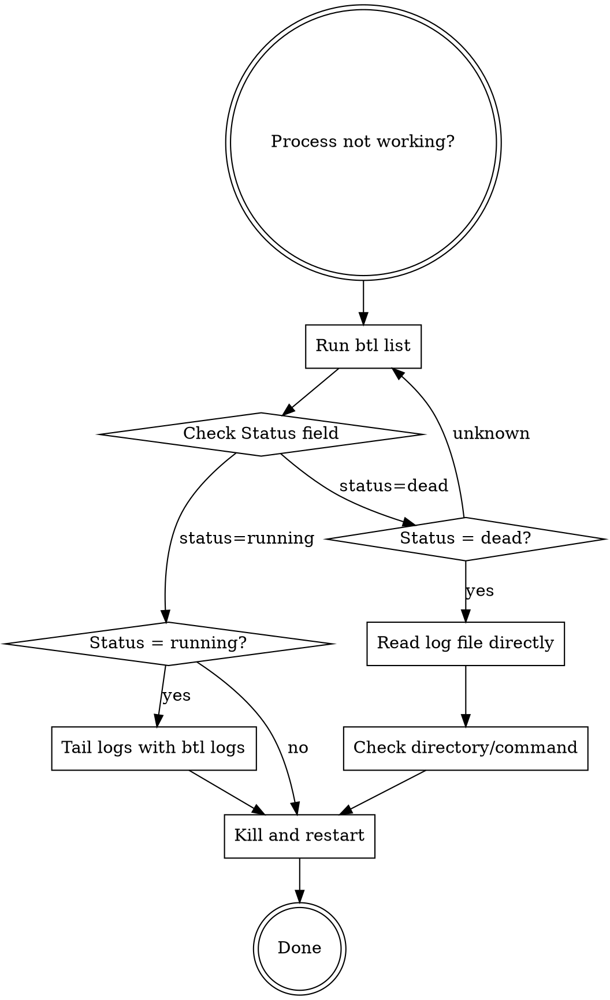

# Using btl (Bottle)

## Overview

btl backgrounds processes and automatically replaces them when you run the same command again. Each command is uniquely identified by directory + command string, so re-running `btl pnpm dev` kills the previous instance and starts fresh.

## When to Use

Use btl when:
- Starting dev servers that should auto-restart (`btl pnpm dev`)
- Running watchers that need replacement (`btl npm run watch`)
- Backgrounding build processes (`btl cargo watch`)
- Managing multiple long-running processes across directories

Don't use btl for:
- Short-lived commands (under 30 seconds)
- Commands that should run multiple instances simultaneously
- Commands you need to interact with (btl backgrounds them)

## Quick Reference

| Command | Purpose |
|---------|---------|
| `btl <command>` | Background command, kill previous if exists |
| `btl list` | Show all tracked processes |
| `btl logs <hash>` | Tail logs for specific process |
| `btl logs` | List all log files |
| `btl kill <hash>` | Kill specific process |
| `btl kill --all` | Kill all tracked processes |
| `btl clean` | Remove dead process entries |
| `btl clean --all` | Clear all state |

## Installation

```bash
# Via cargo (recommended)
cargo install rust-btl

# From source in btl directory
cargo install --path .

# Or use binary directly
./target/release/btl
```

## Core Pattern

**Before (manual process management):**
```bash
# Terminal 1
pnpm dev
# Later: Ctrl+C, restart, repeat...

# Lost track of PIDs
ps aux | grep node
kill 12345
```

**After (with btl):**
```bash
# Start dev server
btl pnpm dev
# [btl] Process backgrounded (PID 12345)
# [btl] Hash: a3f5b2c1
# [btl] Logs: ~/.btl/logs/a3f5b2c1.log

# Later: just run again - automatically kills old, starts new
btl pnpm dev
# [btl] Killing previous process (PID 12345)
# [btl] Process backgrounded (PID 67890)
```

## Integration with Claude Code

When running development commands through Claude Code:

```bash
# Start a dev server that auto-replaces on restart
btl pnpm run dev

# Background multiple different services
btl pnpm run api     # In api/ directory
btl pnpm run frontend # In frontend/ directory

# Check what's running (always check status field)
btl list

# View logs if something goes wrong
# IMPORTANT: Check status first!
# - If status=running: btl logs <hash>
# - If status=dead: cat ~/.btl/logs/<hash>.log
```

## Hash-Based Identification

btl generates a unique hash from:
- Current working directory (PWD)
- Full command string

Same command in different directories = different hashes (run simultaneously)
Same command in same directory = same hash (auto-replace)

## Log Files

All process output goes to `~/.btl/logs/<hash>.log`:
```bash
# View logs for a specific process
btl logs a3f5b2c1

# Or directly
tail -f ~/.btl/logs/a3f5b2c1.log
```

## State Management

btl tracks processes in `~/.btl/state.json`:
- Automatically cleans dead processes
- Validates process ownership (UID)
- Survives terminal closure (uses setsid)

## Common Patterns

### Development Workflow
```bash
# Start dev server
btl pnpm dev

# Work on code...

# Restart automatically (kills old, starts new)
btl pnpm dev

# Check it's running
btl list

# Done for the day
btl kill --all
```

### Multiple Services
```bash
# In project/api/
btl pnpm run dev

# In project/frontend/
btl pnpm run dev

# In project/worker/
btl node worker.js

# List all
btl list
# Shows 3 processes, one per directory
```

### Debugging



**Critical:** Always check status before running `btl logs <hash>`. If status is "dead", the process failed during startup and `btl logs` may hang. Read the log file directly instead.

#### Quick Diagnosis (30 seconds)

When a process isn't working, follow this fast pattern:

```bash
# 1. Check status
btl list

# 2. Based on status:
# - If status=dead: cat ~/.btl/logs/<hash>.log
# - If status=running: btl logs <hash>
# - If no log file: btl clean, check pwd, restart

# 3. Common fixes:
pwd                    # Wrong directory?
ls package.json        # Missing project files?
btl kill <hash>        # Clean up
btl <command>          # Restart
```

#### Status-Based Debugging

| Status | Meaning | Action |
|--------|---------|--------|
| `running` | Process is active | Use `btl logs <hash>` to tail logs |
| `dead` | Process exited/failed | Read `~/.btl/logs/<hash>.log` directly |
| Not in list | Never tracked or cleaned | Check `btl clean` output |

#### Debugging Workflow

**When process is running but misbehaving:**
```bash
# Check status first
btl list

# If status=running, tail live logs
btl logs <hash>

# Or follow logs in real-time
tail -f ~/.btl/logs/<hash>.log
```

**When process died immediately (status=dead):**
```bash
# DO NOT use btl logs - it may hang
# Read log file directly instead
cat ~/.btl/logs/<hash>.log

# Common causes:
# - Wrong directory (no package.json, missing files)
# - Missing dependencies (pnpm/npm not installed)
# - Port already in use
# - Syntax errors in code

# After fixing, clean and restart
btl kill <hash>
# Navigate to correct directory if needed
cd /path/to/project
btl <original-command>
```

**Quick debug pattern:**
```bash
# 1. Check status
btl list

# 2. If dead, read logs directly (don't use btl logs)
cat ~/.btl/logs/<hash>.log

# 3. Common issues to check:
pwd                    # Are you in the right directory?
ls package.json        # Does project file exist here?
which pnpm            # Is tool installed?
lsof -i :<port>       # Is port already taken?

# 4. Fix issue, then restart
btl kill <hash>
btl <command>
```

## Common Mistakes

**Mistake:** Running btl as root
```bash
sudo btl pnpm dev  # ❌ Refuses to run
```
**Fix:** Run as regular user (btl prevents root for safety)

**Mistake:** Expecting to interact with backgrounded process
```bash
btl npm run interactive-prompt  # ❌ Won't work (stdin is null)
```
**Fix:** Only background non-interactive processes

**Mistake:** Forgetting processes are running
```bash
# Started many dev servers, forgot about them
```
**Fix:** `btl list` shows all tracked processes, `btl kill --all` cleans up

**Mistake:** Expecting process to die when terminal closes
```bash
btl pnpm dev
# Close terminal
# Process still runs (by design)
```
**Fix:** This is intentional (uses setsid). Use `btl kill --all` to clean up

**Mistake:** Running `btl logs` on a dead process
```bash
btl list  # Shows status=dead
btl logs <hash>  # ❌ Hangs forever - no logs to tail
```
**Fix:** Check status first. If dead, read log file directly: `cat ~/.btl/logs/<hash>.log`

**Mistake:** Log file doesn't exist for dead process
```bash
cat ~/.btl/logs/<hash>.log  # No such file or directory
```
**Fix:** Process failed before writing logs (wrong directory, spawn failure). Clean dead entry and restart:
```bash
btl clean              # Remove dead entries
pwd                    # Check you're in project directory
cd /path/to/project    # Navigate if needed
btl <original-command> # Restart
```

## Safety Features

- **Root prevention:** Refuses to run as UID 0
- **User isolation:** Only kills processes owned by current user
- **Graceful shutdown:** SIGTERM (3s timeout) → SIGKILL
- **PID validation:** Checks process is alive and owned by expected user
- **Auto-cleanup:** Dead processes removed automatically

## Real-World Impact

**Before btl:**
- Manual PID tracking: `ps aux | grep node`
- Lost track of background processes
- Forgot to kill old instances before starting new ones
- Multiple terminals for different services

**After btl:**
- Single command: `btl pnpm dev`
- Automatic replacement on restart
- All processes tracked in one place
- Logs preserved for debugging
